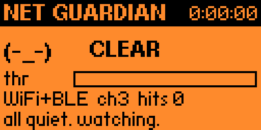
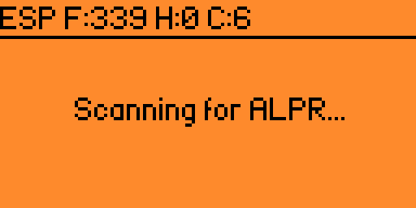
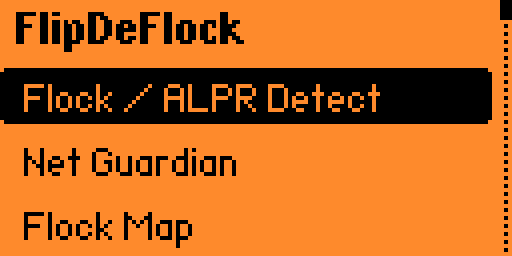
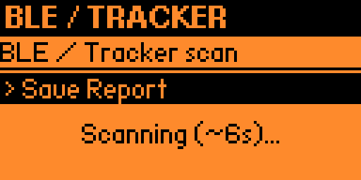
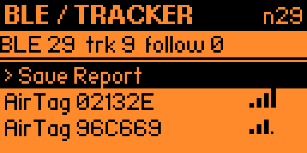
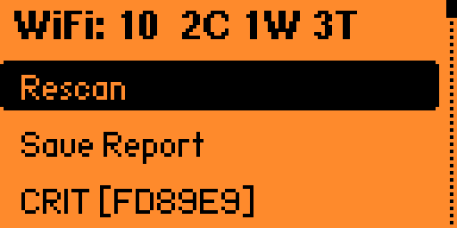
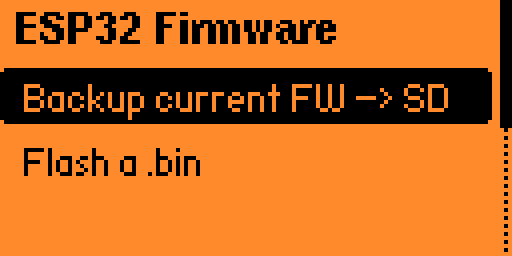

<p align="center">
  
</p>

<p align="center"><em>Snoop onto them as they snoop onto us.</em></p>

FlipDeFlock is a Flipper Zero app that pairs the Flipper with an ESP32 board to
survey the radio around you for surveillance hardware: Flock Safety / ALPR
cameras, Bluetooth trackers that follow you, weak or spoofed Wi-Fi, and active
Wi-Fi attacks. The Flipper is the screen, GPS tagger, and logger; the ESP32 does
the Wi-Fi sniffing its BLE-only radio can't. It's for security assessments,
anti-surveillance awareness, and CTF/research.

**Passive recon only.** It listens; it never transmits — no deauth, injection, or
jamming. Detections are indicators, not proof: OUI-only matches are possible, not
confirmed, so verify by eye. Use it only where you are authorized to.

Builds against Flipper API 87.1, shared by current stock OFW and
[Momentum](https://github.com/Next-Flip/Momentum-Firmware).

## Install

Download `flipdeflock.fap` from the [latest release](../../releases/latest), copy
it to `apps/Tools/` on your Flipper's SD card, and launch **FlipDeFlock** from the
Tools menu. Every push also builds a fresh `.fap` as a CI artifact under the
**Actions** tab.

If a newer firmware bumps the API and the app refuses to load ("API mismatch"),
rebuild it with `ufbt` — see [Build from source](#build-from-source).

## Hardware

The Flipper's onboard radio is BLE-only and can't do Wi-Fi monitor mode. Flock
cameras are found most reliably by the Wi-Fi probe requests they spray trying to
phone home, so the Wi-Fi work runs on an ESP32. Any ESP32 Flipper board works —
Wi-Fi Dev Board, ESP32 Marauder boards, ReksLab Tri-Board, bare WROOM/WROVER,
Xiao ESP32-S3.

Wire the ESP32 (and an optional GPS module) to the Flipper's GPIO:

| Device | Flipper port | Pins |
|--------|--------------|------|
| ESP32  | USART  | 13 (TX) / 14 (RX), 3V3, GND |
| GPS    | LPUART | 15 / 16 |

Both run at once. Ports and bauds are configurable in **Settings** for boards with
nonstandard pinouts. Turn **GPS** on in Settings to geotag detections. Settings
persist.

### Board Mode

Set **Board Mode** in Settings to match your ESP32 firmware:

- **Marauder** — keep the board's existing firmware, no flashing. You get Flock /
  ALPR Detect, NFC / RFID audit, GPS, and Reports. The app scrapes MAC/SSID tokens
  from whatever Marauder prints and applies the Flock filter on the Flipper.
- **Companion** — the project firmware in `esp32_companion/`, a clean line
  protocol. Adds WiFi Audit, BLE / Tracker Scan, Net Guardian, Locator, passive
  deauth detection, and dual-band (Wi-Fi + BLE) Flock detection. Flash it from the
  app with **ESP32 Firmware** (no computer needed) or with Arduino IDE /
  arduino-cli (see [`esp32_companion/README.md`](esp32_companion/README.md)).

## What it does

Each item is a screen in the app. Screens marked *(companion)* need the companion
firmware; in Marauder mode they explain what's missing.

- **Flock / ALPR Detect** — the main camera hunt. Finds Flock Safety / ALPR cameras
  over Wi-Fi (and BLE, with the companion), geotags them, and lets you mark them
  for a report. Each row carries a confidence tag (see
  [Detection confidence](#detection-confidence)) and shows its source — probe,
  beacon, or BLE — in the detail view. A `!DEAUTH ch<n> <bssid>` banner appears
  while a deauth/disassoc flood is active and clears when it stops.
- **Flock Map** — a live map around your GPS position: you're at center, cameras
  are plotted by bearing and distance, dot size is confidence, with a heading tick
  and a scale bar. Left/Right zoom, OK re-fits. Needs a GPS fix; ungeotagged
  cameras aren't plotted.
- **WiFi Audit** *(companion)* — grades each nearby network worst-first
  (Open/WEP/WPA1/WPA2/WPA3, WPS, TKIP, hidden) and flags evil-twin SSIDs (same
  name, different BSSIDs). Open a row for the auth/cipher/WPS/vendor breakdown and
  exactly what's weak. Also detects deauth/disassoc floods live. Marauder can't
  report encryption over serial, so this needs the companion.
- **BLE / Tracker Scan** *(companion)* — detects AirTag / Tile / SmartTag / Google
  Find My trackers and Flock/Raven BLE. With GPS on, a tracker that stays with you
  across several waypoints is flagged `!FOLLOWING` (anti-stalking); open it for the
  track. Labels a **Flock Raven (audio sensor)** only when it sees the Raven's own
  Bluetooth services — it never guesses "camera" by elimination.
- **Net Guardian** *(companion)* — a leave-it-on-the-desk watch face. Keeps the ESP
  running and rotates it across Wi-Fi and BLE so the fused **CLEAR / WATCHFUL /
  ELEVATED** "am I being watched?" score stays live, with a pwnagotchi-style face
  and a haptic on the edge into ELEVATED. Counts Flock cameras, nearby Flipper
  Zeros, and active attacks — deauth/disassoc floods, evil-twin APs, and
  attack-tool signatures (BLE-spam, Pineapple/Marauder beacon-spam, probe floods).
  It reaches ELEVATED only when two independent radios agree. Press **OK** for a
  Suspicious list and send one to the Locator. An opt-in Anomaly flag (Settings,
  default off) adds unidentified-device flagging.
- **Locator** *(companion)* — hunt a marked device by live signal strength: a
  hot/cold meter that climbs as you get closer, peak-hold, and a warmer/colder
  trend. Mark a target from any Flock / BLE / WiFi detection or from the Guardian's
  Suspicious list. Works without GPS (a fix only adds a "strongest here" note).
  There's no compass arrow — direction-finding a transmitter needs a directional
  antenna, so you close in by walking.
- **NFC / RFID Audit** — identifies a presented card's protocol and grades its
  security for access-control reviews. On a MIFARE Classic, a **Deep** check
  captures the UID and tries the Flipper's on-SD key dictionary against every
  sector, reporting how many open with default keys (`N/total` = trivially
  cloneable). Audit only cards you own or are authorized to test.
- **ESP32 Firmware** — backs up the board's current firmware to SD, then flashes a
  `.bin` (companion, Marauder, or a backup) at `0x0`, straight from the Flipper.
  Put the ESP in bootloader/download mode first (hold **BOOT**, tap **RESET**). It
  talks to the bare ROM loader and MD5-verifies the write; flash speed is Safe
  (115200) or Fast (230400) in Settings. You can't brick it — the ROM bootloader
  always allows a re-flash. Built on Espressif's esp-serial-flasher. **Back up
  before you flash.**
- **Reports** — writes to `apps_data/flipdeflock/reports/`: Markdown,
  DeFlock-compatible GeoJSON, KML, plain CSV, and WiGLE CSV (Wi-Fi and BLE) for
  wardriving uploads. Reports stream row-by-row to SD, so a large scan won't run
  the Flipper out of memory. Pull them with qFlipper or a card reader.
- **Share to DeFlock** — renders a QR per marked, geotagged camera that opens
  [DeFlock](https://deflock.org) at that location on your phone, so you submit
  through the official app's review flow. The Flipper and ESP never touch a
  network. No Flipper GPS? DeFlock lets you place the pin by hand at
  [deflock.org/report](https://deflock.org/report).

## Screenshots

<p align="center">
  
  <br><em>Net Guardian — the always-on watch face</em>
</p>

| | |
|:--:|:--:|
| <br>**Flock / ALPR Detect** | <br>**Main menu** |
| <br>**BLE / Tracker scan** | <br>**BLE / Tracker results** |
| <br>**WiFi Audit** | <br>**ESP32 Firmware** |

## Detection confidence

Flock-associated OUIs are generic vendor prefixes (shared with Espressif and
others), so a prefix match alone is weak evidence. Confidence is scored
accordingly:

| Signal | Confidence |
|--------|------------|
| OUI prefix only | `Possible` |
| OUI + phone-home probe request | `Likely` |
| SSID is `Flock-` + 6 hex, or contains `test_flck` | `CONFIRMED` |
| Unverified user IE fingerprint | `Class?` (candidate device-class, never Confirmed) |

A benign name like `Flock-Guest` or `Flock Freight` does not Confirm — only the
exact provisioning-AP name does; those drop to `Likely`.

You can extend detection without a rebuild: drop `signatures.json` into
`apps_data/flipdeflock/` with extra `ouis`, `ssid_confirmed`, `ssid_likely`, and
`ie_fps` (8-hex probe fingerprints, capped at 32). It is load-only, offline, and
fail-safe — a missing or broken file falls back to the built-ins, and user entries
can only add detections, never override the precision rules (a user IE fingerprint
maxes out at `Class?`). Each detection's fingerprint shows as `IE-fp:` on its
detail screen, so you can read one off a confirmed camera and catch its
MAC-randomized twins. See the [signatures guide](docs/signatures.md).

## On-screen legend

RSSI is shown as signal bars (taller = stronger); the highlighted row shows the
exact dB. `-33dB` closer to 0 means physically closer.

**Net Guardian** — e.g. `(-_-) CLEAR · Flock 0  Atk 0  Flip 0 · WiFi+BLE ch6  OK=sus · 0:00:07`
- **face / word** — fused state: `(-_-)` CLEAR → `(o_o)` WATCHFUL → `(>_<)` ELEVATED
- **Flock / Atk / Flip** — this session's Flock detections · active attacks (flood-gated, so a lone benign disassoc doesn't count) · Flipper Zeros advertising nearby
- **bottom line** — sweep radio + channel + `OK=sus` (press OK for the Suspicious list). On an alert it names the cause: `Flipper Zero`, `BLE-spam`, `deauth flood`, `evil-twin AP`, `unknown device on you`
- **0:00:07** — guardian uptime. A Flipper alone raises WATCHFUL; ELEVATED still needs two independent radios

**Flock / ALPR Detect** — header `ESP ch6  frames 339  hits 0`
- **ESP** (or `...`) — companion connected / still waiting
- **ch / frames / hits** — channel · 802.11 frames captured · Flock detections, counted this session (reset each time you open the screen)
- **row tag** — `!` CONFIRMED · `F` probe-fingerprint · `L` Likely · `p` Possible · `.` OUI-only · `*` marked
- Marauder mode shows `rx <n>  hits <n>` instead (serial heartbeat + detection count)

**BLE / Tracker Scan** — header `BLE 33  trk 9  follow 0`
- **BLE / trk / follow** — total BLE devices · known trackers · trackers flagged following you
- **row** — `<type> <name|MAC-tail> <rssi>dB`; type = `FLOCK` / `AirTag` / `Tile` / `Tag` / `FindMy` / `Flipper` / `BLE`. A `Flipper` is a recon device, not a tracker, so it isn't in `trk`
- **prefix** — `!` following · `*` tagged

**WiFi Audit** — header `10 AP  2crit 1weak 3twin`
- **AP / crit / weak / twin** — total APs · critical-grade · weak-grade · evil-twin/duplicate-SSID
- **row grade** — `CRIT` / `WEAK` / `OK` / `STRONG` / `INFO`
- **marker** — `!` rogue/evil-twin (same SSID, mismatched security) · `~` duplicate SSID (mesh?) · `*` tagged · `[ABCDEF]` a hidden SSID (last 3 BSSID bytes)

**Locator**
- **mark first** — the report star on any Flock / BLE / WiFi detection adds it to the Locator pool; or pick one from the Guardian's Suspicious list
- **meter / dB** — climbs as you get closer; `WARMER`/`colder` is the trend, the tick above the bar is peak-hold. `out of range` means the target went quiet — walk back to where it was loudest

## Build from source

With [ufbt](https://pypi.org/project/ufbt/) (standalone):

```sh
pip install ufbt
ufbt            # builds flipdeflock.fap in dist/
ufbt launch     # build + install + run on a connected Flipper
```

Inside a Momentum/OFW tree: drop this folder into `applications_user/` and run
`./fbt fap_flipdeflock`. For the ESP32 companion firmware, see
[`esp32_companion/README.md`](esp32_companion/README.md).

## Status

FlipDeFlock is actively developed, not finished. It's useful in the field, but
features are still landing, detection signatures change as surveillance hardware
changes, and not every path is hardware-tested on every board. Expect rough edges
and the occasional breaking change between versions. Treat detections as
indicators and verify by eye; if you rely on it for anything that matters, read
the code and confirm the behavior yourself.

## What's new

**v0.43** — Precision, correctness, and a test safety net; no new screens. Only the
real `Flock-` + 6-hex provisioning name Confirms now, and an OUI + broadcast-probe
match caps at Likely. Fixes across NFC (verdict binds to the card actually
presented), GPS (no stale fix, checksum-verified NMEA), and report escaping (a
hostile SSID/BLE name can't break a CSV column or inject a KML element). Adds a
291-check host unit-test suite wired into CI and a companion wire-protocol version
handshake.

**v0.42** — Catch MAC-randomizing cameras via probe IE fingerprints, updatable from
`signatures.json` (`ie_fps`) without a rebuild; each detection's `IE-fp:` is shown
so you can harvest it from a confirmed unit.

**v0.41** — Locator (find a marked device by signal) and a Suspicious list on the
Net Guardian.

**v0.34–v0.39** — Net Guardian: the always-on fused watch face, then Flipper /
attack-tool / opt-in anomaly detection on top of deauth floods and evil-twin APs.

**v0.25** — Positive Raven (audio sensor) labeling, and the updatable
`signatures.json` database.

Full history in [changelog.md](changelog.md).

## Layout

```
application.fam          manifest
recon_app.c / _i.h       lifecycle, shared state, settings
scenes/                  start, flock, guardian, locator, map, wifi, ble, nfc,
                         firmware, reports, deflock_handoff, settings, about
views/                   flock list, on-device map, DeFlock QR, guardian face,
                         locator HUD, ble/wifi lists
helpers/
  flock_db / detect_rules / sig_db   Flock OUIs, SSID/IE signatures, confidence scoring
  esp_link / esp_parser              ESP32 UART link (companion + generic backends)
  esp_flasher                        in-app ESP32 backup/flash (esp-serial-flasher port)
  gps_link / gps_parser              NMEA GPS reader (2nd UART)
  recon_nfc                          NFC scanner + grading + default-key deep check
  recon_report / report_escape       Markdown + GeoJSON + KML + CSV/WiGLE writers
  watchscore / scan_session          fused surveillance score, scan lifecycle
lib/esp-serial-flasher/  vendored Espressif flasher (Apache-2.0)
lib/qrcodegen/           vendored Nayuki QR Code generator (MIT)
esp32_companion/         universal ESP32 firmware + flashing guide
```

Prebuilt binaries are published on [Releases](../../releases) and as per-push CI
artifacts, not committed to the repo.

## Credits

The detection method and Flock OUI prefixes build on
[colonelpanichacks/flock-you](https://github.com/colonelpanichacks/flock-you),
[0xXyc/flock-you-wifi-recon](https://github.com/0xXyc/flock-you-wifi-recon), and
the [DeFlock](https://deflock.org) community. The GPS NMEA approach is based on the
Momentum Sub-GHz GPS helper.

## License

**GPL-3.0-or-later** — see [LICENSE](LICENSE). Copyright (c) 2026 ReconGrunt and
FlipDeFlock contributors.

If you distribute a modified version, publish your source under the same terms and
keep the notices intact. Bundled third-party components keep their own compatible
licenses: esp-serial-flasher (Apache-2.0), Nayuki qrcodegen (MIT), jsmn (MIT), and
the ESP MD5 routine (BSD) — see the headers under `lib/`.

**Name & trademark.** The code is free to reuse under the GPL, but the
**"FlipDeFlock"** name and logo are the project's identity, not part of the
licensed code. Don't publish a fork, repackage, or store listing under the
FlipDeFlock name or logo in a way that implies it's official. Rename your
derivative — a "based on FlipDeFlock" credit is welcome. Forking on GitHub keeps
the link and credit intact.

## Contributing

This is a community counter-surveillance effort; it improves with more boards and
more field data. The most useful contributions:

- **Field reports & signatures** — new Flock/ALPR OUIs, SSID/BLE patterns, or false
  positives and misses. Test a candidate in your own `signatures.json` first (see
  the [signatures guide](docs/signatures.md)), then send the ones that hold up.
- **Board support** — try it on your ESP32 and report wiring quirks.
- **Code** — bug fixes, report formats, or roadmap items.

Ground rules:

- **Passive recon only.** No deauth, injection, or jamming, ever.
- **Correctness over features.** A false positive is worse than a missed detection;
  don't trade precision for recall without good reason.
- Target **API 87.1**; it must build with both `ufbt` and `fbt`.
- Keep it lean — the `.fap` loads entirely into the Flipper's ~256 KB of RAM.

By contributing you agree to license your work under GPL-3.0-or-later.

## Support & roadmap

FlipDeFlock is free and stays that way. To help cover development (and the legal
costs of mapping surveillance hardware), use the **Sponsor** button at the top of
the repo, [Ko-fi](https://ko-fi.com/recongrunt), or
[Buy Me a Coffee](https://buymeacoffee.com/recongrunt). Donations never gate a
feature.

Planned work and deferred items (with reasons) are in [ROADMAP.md](ROADMAP.md).
